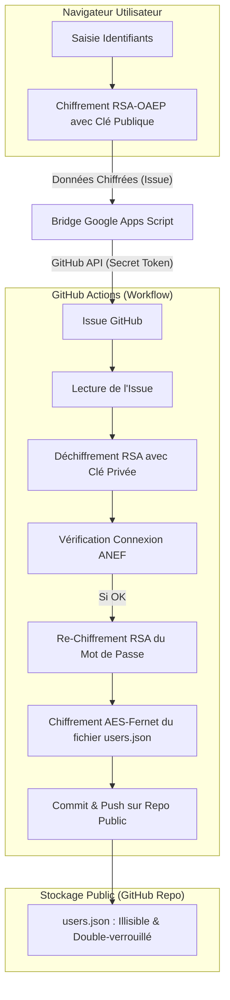

# 📡 ANEF Tracker — Suivi de dossier automatique

Ce projet permet de surveiller automatiquement l'état d'avancement de votre dossier sur le portail [ANEF (Administration Numérique des Étrangers en France)](https://administration-etrangers-en-france.interieur.gouv.fr/particuliers/).

Dès qu'un changement est détecté (modification de la `date_statut` dans l'API interne), vous recevez immédiatement une notification par email via **Resend**.

## ✨ Fonctionnalités

- **🕰️ Surveillance horaire** : Vérification automatique toutes les heures via GitHub Actions.
- **🔐 Double Sécurité Maximale (Blindage)** :
  - **Mots de passe** : Chiffrés en RSA-OAEP dans le navigateur. Ils ne circulent jamais en clair.
  - **Double Layer** : Même déchiffrés par le serveur, les mots de passe sont stockés **chiffrés par RSA** dans la base de données.
  - **Stockage** : Le fichier `users.json` entier est lui-même **chiffré en AES** (Fernet) sur le dépôt.
- **📧 Emails Gratuits** : Utilise l'API **Resend** (3000 emails/mois gratuits).
- **🚀 Expérience Zero-Token** : L'utilisateur final n'a **aucun token GitHub** à gérer. L'inscription est 100% automatique via un bridge sécurisé.
- **🌐 Compatible Repo Public** : La sécurité est telle que vous pouvez héberger ce projet sur un dépôt public avec GitHub Pages gratuit sans risque pour vos données.

## 🏗️ Architecture et Flux de Sécurité

Voici comment vos données sont protégées de bout en bout :



### Pourquoi c'est ultra-sécurisé ?
1.  **Le "Double-Verrou"** : Même si un hacker vole votre `STORAGE_KEY`, il ne verra que des blocs de texte RSA. Sans votre `RSA_PRIVATE_KEY` (qui dort dans les coffres de GitHub), le mot de passe reste indéchiffrable.
2.  **Zéro Fuite** : Votre clé privée et votre token GitHub ne sont jamais exposés au navigateur ou au bridge public.

## 🛠️ Installation et Configuration (Pas à pas)

### 1. Créer le dépôt
Créez un nouveau dépôt sur GitHub (Public ou Privé) et poussez le code dedans.

### 2. Générer les Clés de Sécurité
Installez la bibliothèque nécessaire : `pip install cryptography`.

1.  **Clés RSA (Double Chiffrement)** :
    ```bash
    python generate_key.py --rsa
    ```
    - Ajoutez la **Private Key** dans les Secrets GitHub (`RSA_PRIVATE_KEY`).
    - Copiez la **Public Key** dans `index.html` (`RSA_PUBLIC_KEY_PEM`).

2.  **Clé de Stockage (Chiffrement du fichier)** :
    ```bash
    python generate_key.py --storage
    ```
    - Ajoutez cette clé dans les Secrets GitHub (`STORAGE_KEY`).

### 3. Configurer le Bridge (Google Apps Script)
Le bridge permet d'automatiser la création des demandes d'inscription sans exposer votre Token GitHub :
1.  Créez un nouveau projet sur [script.google.com](https://script.google.com/).
2.  Collez le code de bridge fourni (il contient votre Token GitHub de manière sécurisée).
3.  Déployez en tant qu'**Application Web** (Accès : Tout le monde).
4.  Copiez l'URL et collez-la dans `index.html` (`GAS_BRIDGE_URL`).

### 4. Configurer les Secrets GitHub (4 Secrets)
Dans **Settings > Secrets and variables > Actions**, ajoutez :
- `RSA_PRIVATE_KEY` : Votre clé privée RSA.
- `STORAGE_KEY` : Votre clé de stockage Fernet.
- `RESEND_API_KEY` : Votre clé API Resend (`re_...`).
- `EMAIL_FROM` : (Optionnel) Votre email vérifié ou `onboarding@resend.dev`.

### 5. Déployer l'Interface Web
Activez **GitHub Pages** dans **Settings > Pages** (Branche `main`, dossier `/ (root)`).

## 🚀 Utilisation

1.  Ouvrez votre URL GitHub Pages.
2.  Inscrivez-vous simplement avec vos identifiants ANEF.
3.  Le système s'occupe de tout : chiffrement, création de l'issue, vérification et activation.
4.  Vous recevrez une alerte email dès que votre dossier bouge !

## ⚖️ Licence et Responsabilité

Projet communautaire indépendant. L'auteur n'est pas responsable de l'utilisation faite de cet outil. La sécurité repose sur le chiffrement de bout en bout et la protection de vos secrets GitHub par l'administrateur du dépôt.
